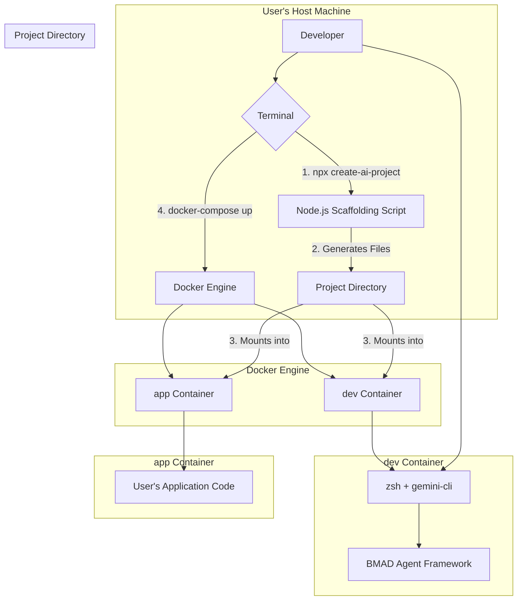

# 2. High-Level Architecture (Revised)

## Technical Summary

The AI Dev Starter Kit is architected as a command-line scaffolding tool (`npx`) built with Node.js. This tool generates a project-specific, multi-container Docker environment on a developer's local machine. The core of the architecture is the separation of the tooling (`dev` container) from the user's application (`app` container), ensuring a clean, decoupled setup. Inside the `dev` container, a Python-based environment runs the `gemini-cli` and the BMAD agentic framework. This provides a **stable, controlled, and extensible toolchain**, ensuring our agents always have the environment they need, independent of the user's local setup.

## Platform and Infrastructure Choice

The primary platform for this solution is the **developer's local machine**. The architecture does not depend on a specific cloud provider (AWS, Google Cloud, etc.) for the MVP.

*   **Platform:** Local Docker Engine
*   **Key Services:** Docker Compose, Node.js (on host)
*   **Deployment Host and Regions:** N/A (Local deployment only)

## Repository Structure

As decided in the PRD, the starter kit's own source code will be managed in a **Monorepo**.

*   **Structure:** Monorepo
*   **Monorepo Tool:** N/A.
*   **Package Organization:** The monorepo will be organized with a `src/` directory containing the Node.js scaffolding application, and a `template/` directory containing all assets to be copied to the user's machine (the `dev/` folder, `Makefile.template`, `docker-compose.template.yaml`, etc.).

## High-Level Architecture Diagram

## Architectural Patterns

*   **Scaffolding:** The core pattern for the `npx` tool, which generates a project structure from a template.
    *   *Rationale:* This provides a repeatable, consistent way to initialize complex environments.
*   **Containerization:** Using Docker to encapsulate the development environment and its dependencies.
    *   *Rationale:* This solves the "it works on my machine" problem and provides a **controlled, extensible environment for the agent toolchain**, ensuring consistency and allowing for future expansion of tools without conflicting with the user's local setup.
*   **Decoupled Services:** The separation of the `dev` (tooling) and `app` (user's code) containers.
    *   *Rationale:* This is the key pattern for enabling brownfield integration without creating dependency conflicts.
*   **Agentic Workflow:** The overall approach of providing specialized AI agents (`gemini-cli`) to perform development tasks.
    *   *Rationale:* This aligns with the project's core goal of accelerating development through AI-assisted coding practices.

---
