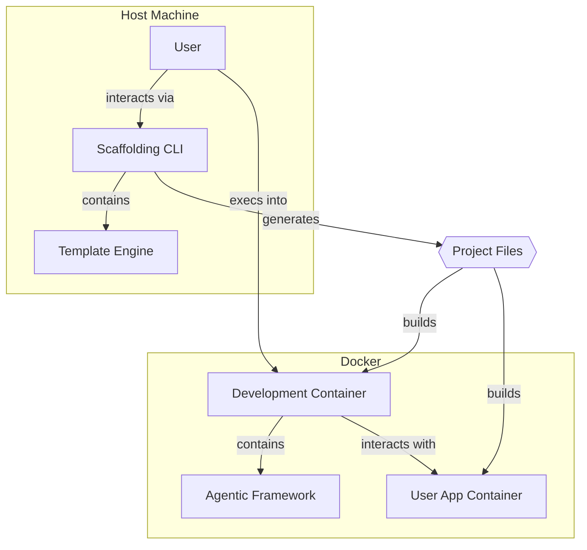

# Components (Revised)

## Component List

### 1. Scaffolding CLI

*   **Responsibility:** Manages the interactive setup with the user. It gathers configuration, generates project files, and **for brownfield projects, it handles the import of the user's existing code by either moving or copying it.** It also handles optional setup for Vercel projects and the Google Agent Development Kit (ADK).
*   **Key Interfaces:** The `npx create-ai-project` command and its flags (e.g., `--vercel`, `--adk-setup`).
*   **Dependencies:** Node.js runtime on the host machine.
*   **Technology Stack:** TypeScript, Node.js, Inquirer.js.

### 2. Template Engine

*   **Responsibility:** A logical component within the Scaffolding CLI. It is responsible for taking the user's configuration choices and using them to correctly process and generate the project files from the source templates. This includes conditionally copying Vercel-specific Docker configurations or the entire `adk/` sample project directory based on user input.
*   **Key Interfaces:** An internal function, e.g., `generateProject(config)`.
*   **Dependencies:** The `ScaffoldingConfig` data model.
*   **Technology Stack:** TypeScript (as part of the Scaffolding CLI).

### 3. Development Container (`dev`)

*   **Responsibility:** Provides the consistent, isolated, and controlled environment that contains the entire AI agent toolchain.
*   **Key Interfaces:** `docker-compose exec dev zsh`, mounted file volumes from the host.
*   **Dependencies:** Docker Engine.
*   **Technology Stack:** Docker, Python, `gemini-cli`, BMAD Framework.

### 4. Agentic Framework

*   **Responsibility:** A logical component that lives inside the `dev` container. It's responsible for executing all agentic tasks, such as context generation and the interactive interviews.
*   **Key Interfaces:** The `gemini-cli` commands (e.g., `gemini agent run ...`).
*   **Dependencies:** The Python runtime within the `dev` container.
*   **Technology Stack:** Python, `gemini-cli`.

### 5. User Application Container (`app`)

*   **Responsibility:** In a brownfield setup, this container runs the user's existing application, which has been moved or copied into the project structure. It is kept completely isolated from the development tooling.
*   **Key Interfaces:** Any ports the user's application exposes (e.g., `localhost:3000`), mounted file volumes.
*   **Dependencies:** Docker Engine.
*   **Technology Stack:** User-defined (any language/framework).

## Component Diagram

---
