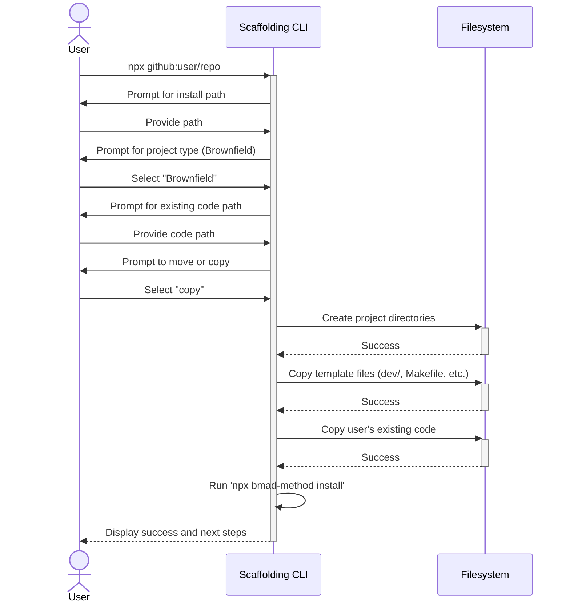

# Core Workflows

This diagram illustrates the step-by-step process of a developer setting up a new brownfield project using the scaffolding tool.

```mermaid
sequenceDiagram
    actor User
    participant CLI as Scaffolding CLI
    participant FS as Filesystem
    
    User->>+CLI: npx github:user/repo
    CLI->>User: Prompt for install path
    User->>CLI: Provide path
    CLI->>User: Prompt for project type (Brownfield)
    User->>CLI: Select "Brownfield"
    CLI->>User: Prompt for existing code path
    User->>CLI: Provide code path
    CLI->>User: Prompt to move or copy
    User->>CLI: Select "copy"
    
    CLI->>+FS: Create project directories
    FS-->>-CLI: Success
    
    CLI->>+FS: Copy template files (dev/, Makefile, etc.)
    FS-->>-CLI: Success
    
    CLI->>+FS: Copy user's existing code
    FS-->>-CLI: Success
    
    CLI->>CLI: Run 'npx bmad-method install'
    
    CLI-->>-User: Display success and next steps
```

---
