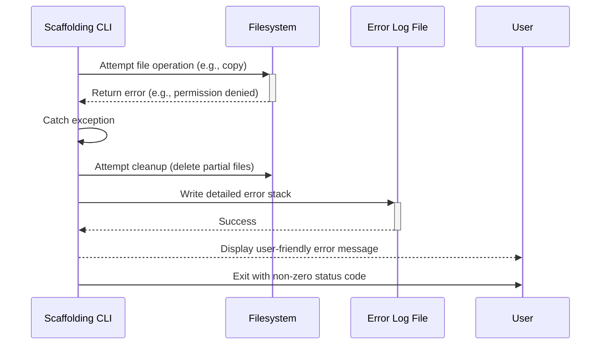

# Error Handling Strategy

## Error Flow (CLI Scaffolding)

This diagram shows the process when an operation fails during the initial project setup.



## Error Response Format

When the CLI encounters a critical error, it will not dump a stack trace at the user. Instead, it will use a clear, consistent format.

```text
❌ Error: Could not write files to the specified directory.

Suggestion: Please check that you have write permissions for this location and try again.
For more details, a log file has been created at: /path/to/project/scaffold-error.log
```

## Frontend (CLI) Error Handling

The Node.js application will use `try...catch` blocks to manage errors gracefully.

*   **Global Catcher:** The main execution function in `index.ts` will be wrapped in a top-level `try...catch` block to handle any unexpected failures.
*   **Specific Handlers:** Each major step (e.g., file generation, installer) will have its own `try...catch` block to provide more specific context.
*   **Process on Failure:** When an error is caught, the script will:
    1.  Log the full, technical error stack to a local `scaffold-error.log` file.
    2.  Run a cleanup function to remove any partially created directories or files.
    3.  Display the simple, user-friendly error message formatted as defined above.
    4.  Exit the process with a non-zero exit code (e.g., `process.exit(1)`).

## Backend (Agent) Error Handling

Error handling within the agentic framework is managed by the `gemini-cli` and the agent's persona.

*   **Tool Failures:** If a tool like `write_file` fails, the framework should report this failure back to the agent. The agent's persona should be designed to handle this (e.g., by retrying, asking the user for help, or trying a different approach).
*   **LLM Errors:** If the LLM API returns an error or an invalid response, the LLM client within the framework should catch this and raise a specific exception. The agent runner can then decide whether to retry the request or report the failure to the user.

---
